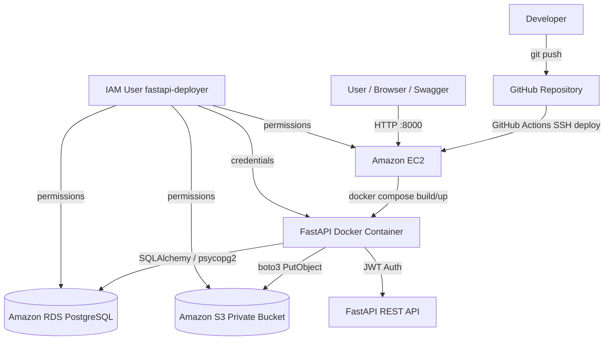

# FPT Customer Chatbot API

## 1. Project Overview

FPT Customer Chatbot API is a FastAPI backend for customer support workflows. It provides JWT authentication, user profile management, support ticket CRUD, room booking CRUD, optional AI chatbot conversations, and authenticated file uploads to Amazon S3.

The application is configured for AWS deployment with Amazon RDS PostgreSQL, Amazon S3, Docker on Amazon EC2, and GitHub Actions CI/CD.

## 2. Architecture Diagram



## 3. Prerequisites

- AWS account with access to IAM, EC2, RDS, and S3.
- IAM user `fastapi-deployer` with programmatic access.
- AWS CLI configured locally.
- Python 3.11+.
- Docker and Docker Compose.
- Git and a GitHub repository.
- EC2 key pair private key, for example `fastapi-key.pem`.
- Amazon RDS PostgreSQL instance reachable from the application.
- S3 bucket for private file storage.

## 4. Local Development Setup

Create and activate a virtual environment:

```powershell
cd C:\Workplace\Projects\FastAPI_Final
python -m venv venv
.\venv\Scripts\activate
pip install -r fpt_customer_chatbot_api\requirements.txt
```

Create `fpt_customer_chatbot_api/.env` from `fpt_customer_chatbot_api/.env.example`, then fill in local or AWS values.

Run the app locally:

```powershell
uvicorn fpt_customer_chatbot_api.main:app --reload
```

Open:

```text
http://localhost:8000/
http://localhost:8000/docs
```

Run with Docker locally:

```powershell
docker compose build
docker compose up -d
docker ps
```

The default Compose setup disables AI chat and uses SQLite so the local Docker build stays lightweight.

## 5. AWS Resources

- IAM user: `fastapi-deployer`
- IAM permissions:
  - EC2: `ec2:DescribeInstances`, `ec2:StartInstances`, `ec2:StopInstances`
  - S3: `s3:GetObject`, `s3:PutObject`, `s3:DeleteObject`, `s3:ListBucket`
  - RDS: `rds:DescribeDBInstances`, `rds:Connect`
- RDS PostgreSQL:
  - DB identifier: `fastapi-db`
  - Engine: PostgreSQL 15.x
  - Database name: `fastapi_prod`
  - Port: `5432`
- S3 bucket:
  - Example: `fastapi-app-files-huynd115`
  - Block Public Access enabled
- EC2:
  - Amazon Linux 2023 or Ubuntu 22.04
  - Security group allows SSH `22`, HTTP `80`, and app port `8000`
- GitHub Actions:
  - Workflow: `.github/workflows/deploy.yml`

## 6. Environment Variables

Create `fpt_customer_chatbot_api/.env` locally or let GitHub Actions create it on EC2 from repository secrets.

```env
PROJECT_NAME="FPT Customer Chatbot API"
VERSION="1.0.0"
API_V1_STR="/api/v1"
SECRET_KEY="replace-with-a-secure-secret"
ALGORITHM="HS256"
ACCESS_TOKEN_EXPIRE_MINUTES=60

# Local fallback
SQLALCHEMY_DATABASE_URL="sqlite:///./fpt_chatbot.db"

# AWS RDS PostgreSQL
DATABASE_URL="postgresql+psycopg2://postgres:<password>@<rds-endpoint>:5432/fastapi_prod"
DATABASE_SSLMODE="verify-full"
DATABASE_SSLROOTCERT="./global-bundle.pem"

# AWS S3
AWS_REGION="ap-southeast-1"
S3_BUCKET_NAME="fastapi-app-files-<your-id>"
AWS_ACCESS_KEY_ID="<iam-access-key>"
AWS_SECRET_ACCESS_KEY="<iam-secret-key>"
AWS_SESSION_TOKEN=""

# Optional AI features
ENABLE_AI_CHAT=false
OPENAI_API_KEY=""
TAVILY_API_KEY=""
```

Required GitHub repository secrets for CI/CD:

```text
AWS_ACCESS_KEY_ID
AWS_SECRET_ACCESS_KEY
EC2_HOST
EC2_SSH_KEY
DATABASE_URL
S3_BUCKET_NAME
```

Optional GitHub repository secrets:

```text
SECRET_KEY
OPENAI_API_KEY
TAVILY_API_KEY
```

## 7. Deployment Instructions

### Manual EC2 Deployment

SSH into EC2:

```powershell
ssh -i "C:\path\to\fastapi-key.pem" ec2-user@<ec2-public-ip>
```

Install and start Docker if needed:

```bash
sudo dnf update -y
sudo dnf install -y docker git
sudo systemctl enable --now docker
sudo usermod -aG docker ec2-user
```

Clone the repository:

```bash
git clone https://github.com/<your-user>/<your-repo>.git ~/fastapi-final
cd ~/fastapi-final
```

Create `fpt_customer_chatbot_api/.env` with production values, then build and run:

```bash
docker compose --env-file fpt_customer_chatbot_api/.env \
  -f docker-compose.yml \
  -f docker-compose.prod.yml \
  build

docker compose --env-file fpt_customer_chatbot_api/.env \
  -f docker-compose.yml \
  -f docker-compose.prod.yml \
  up -d
```

Verify on EC2:

```bash
docker ps
curl http://localhost:8000/
```

Verify from your browser:

```text
http://<ec2-public-ip>:8000/
http://<ec2-public-ip>:8000/docs
```

### GitHub Actions CI/CD

1. Add the required GitHub repository secrets.
2. Push to `main` or `master`.
3. Open GitHub Actions and run `Deploy to EC2`.
4. The workflow SSHes into EC2, pulls the latest code, writes `.env`, rebuilds the Docker image, restarts the container, and verifies `http://localhost:8000/`.

## 8. API Documentation

Interactive documentation:

```text
http://localhost:8000/docs
http://localhost:8000/redoc
http://<ec2-public-ip>:8000/docs
```

Root:

- `GET /` - Health/welcome response.

Auth:

- `POST /api/v1/auth/register` - Register a user.
- `POST /api/v1/auth/login` - Login and receive JWT access token.

Users:

- `GET /api/v1/users/me` - Get current authenticated user.
- `PUT /api/v1/users/me` - Update current authenticated user.

Tickets:

- `POST /api/v1/tickets/` - Create a support ticket.
- `GET /api/v1/tickets/` - List current user's tickets.
- `GET /api/v1/tickets/{ticket_id}` - Get one ticket.
- `PUT /api/v1/tickets/{ticket_id}` - Update ticket status/details.
- `DELETE /api/v1/tickets/{ticket_id}` - Cancel a ticket.

Bookings:

- `POST /api/v1/bookings/` - Create a room booking.
- `GET /api/v1/bookings/` - List current user's bookings.
- `GET /api/v1/bookings/{booking_id}` - Get one booking.
- `PUT /api/v1/bookings/{booking_id}` - Update a booking.
- `DELETE /api/v1/bookings/{booking_id}` - Cancel a booking.

Files:

- `POST /api/v1/files/upload` - Upload an authenticated user's file to the private S3 bucket.

Chat, when `ENABLE_AI_CHAT=true`:

- `POST /api/v1/chat/conversations` - Start a chatbot conversation.
- `GET /api/v1/chat/conversations` - List conversations.
- `POST /api/v1/chat/conversations/{conversation_id}/messages` - Send a chatbot message.
- `POST /api/v1/chat/conversations/{conversation_id}/confirm` - Confirm or cancel a pending HITL action.

Most endpoints except registration/login require an `Authorization: Bearer <access_token>` header.
